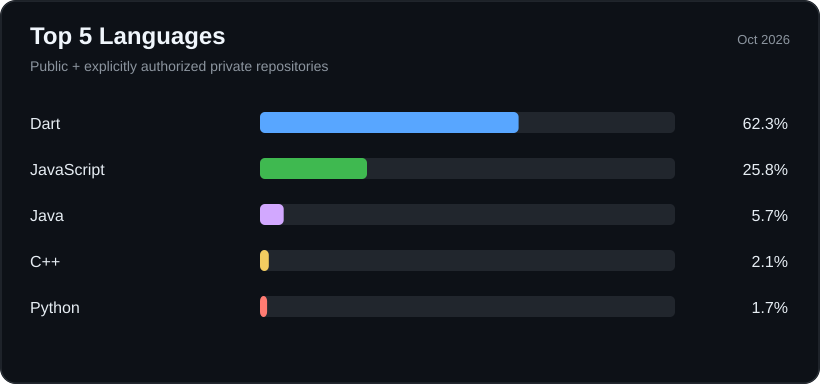

<h1 align="center">Hi, I'm Alfarouq 👋</h1>

  <strong>Computer Science (AI Track) @ King Saud University</strong> 
  GPA: <strong>5.00 / 5.00</strong> · Flutter Developer · Project Lead

---

###
### 🛠️ Tech stack

**Mobile & state management**

**Backend & cloud**

**Programming & tooling**

### 📊 Languages across my repositories

  

### 📈 GitHub activity

  
  

---

  <a href="https://github.com/Alfarouq-Alshukri">Explore my GitHub profile</a>

